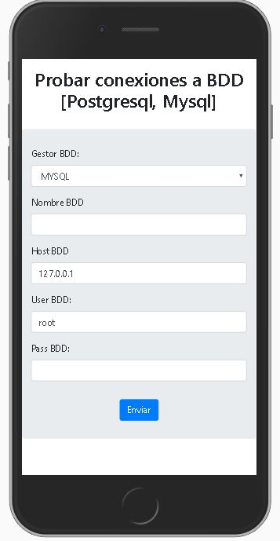
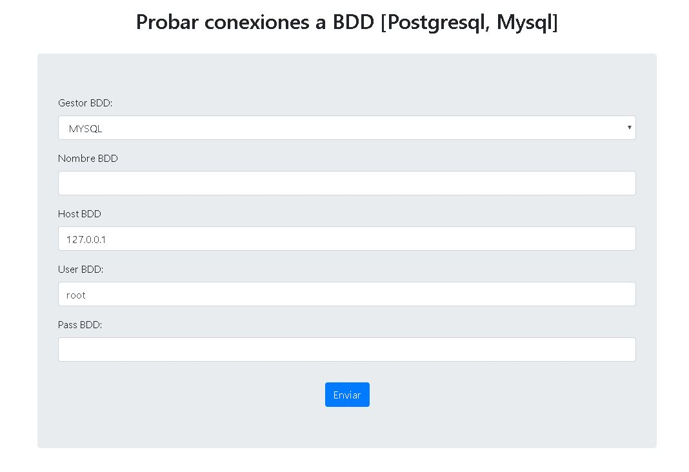
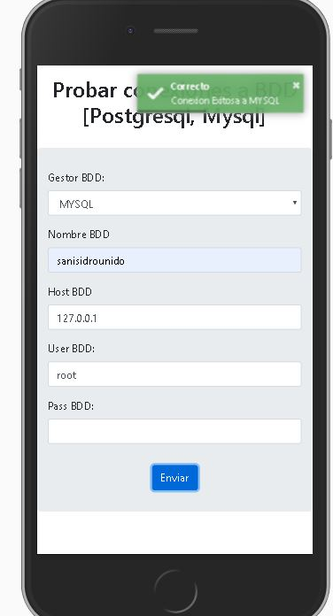
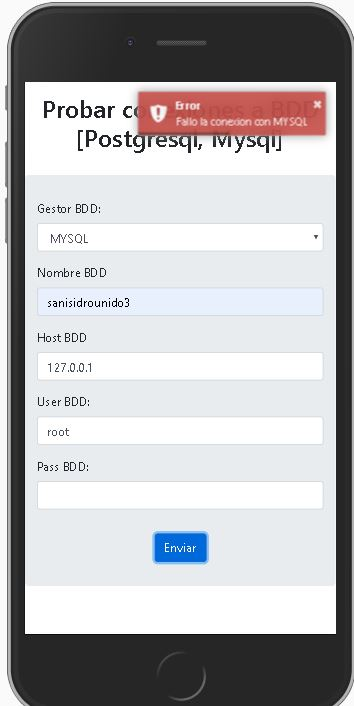

# Proyecto Probar Conexiones desde PHP 7 a PostgreSQL y MySQL

El proyecto cuenta con las siguientes características:
- Probar la conexión con MYSQL
- Probar la Conexión con PostgreSQL
- Notificación Toast sobre el estado de la conexión

## Imagenes

**Móvil**

**Web**

**Exito**

**Fallido**

